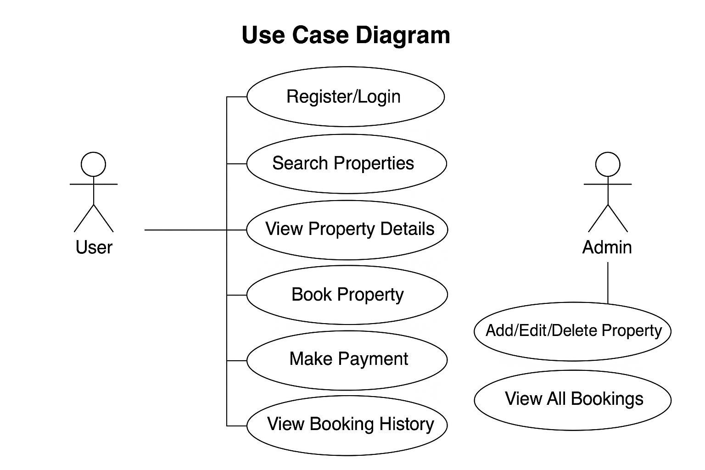

# Requirement Analysis in Software Development

## Introduction

This repository documents the Requirement Analysis phase of the software development lifecycle (SDLC), using a **Booking Management System** as a case study. The goal is to explore how clearly defined and structured requirements lead to more successful software projects.

---

## What is Requirement Analysis?

**Requirement Analysis** is a foundational stage in the SDLC where the needs and expectations of stakeholders are identified, analyzed, and documented. It involves understanding what the users require from the system, clarifying ambiguities, and ensuring that all functionalities are defined in detail before development begins.

It serves as a blueprint for both developers and business stakeholders to align on *what* the system will do and *how* it will perform, ultimately reducing risks, cost overruns, and scope creep.

---

## Why is Requirement Analysis Important?

1. **Clarity of Project Scope**  
   It defines what the system should do, helping teams avoid misunderstandings and misaligned expectations.

2. **Improved Planning and Estimation**  
   Accurate requirements allow for better resource allocation, timelines, and budgeting.

3. **Reduced Rework and Bugs**  
   Catching errors in the planning stage is far cheaper than fixing them during or after development.

---

## Key Activities in Requirement Analysis

- **Requirement Gathering**  
  Collecting information from stakeholders via interviews, surveys, and observations.

- **Requirement Elicitation**  
  Expanding and refining requirements through prototyping, brainstorming, and use case creation.

- **Requirement Documentation**  
  Structuring the requirements into formal documents like SRS (Software Requirement Specification).

- **Requirement Analysis and Modeling**  
  Interpreting and organizing requirements into visual models, flowcharts, and diagrams.

- **Requirement Validation**  
  Ensuring that all documented requirements are accurate, complete, and aligned with user expectations.

---

## Types of Requirements

### ✅ Functional Requirements

These define *what* the system should do.

**Examples for the Booking Management System:**
- User registration and login
- Search and filter properties
- Book or cancel reservations
- Payment processing
- Generate booking confirmation

### 🔒 Non-Functional Requirements

These define *how* the system performs its functions.

**Examples:**
- Load time under 2 seconds
- Data should be encrypted in transit and at rest
- The system must support up to 1,000 concurrent users
- 99.9% uptime availability
- Compatible with major browsers

---

## Use Case Diagrams

Use case diagrams show the interaction between users (actors) and the system functionalities (use cases).

**Benefits:**
- Clarifies system boundaries
- Visualizes different user roles and interactions
- Helps identify key system behaviors

---

## Acceptance Criteria

**Acceptance Criteria** define the conditions that must be met for a feature to be accepted by stakeholders. It provides a checklist to verify if a requirement has been implemented correctly.

**Example: Checkout Feature – Acceptance Criteria**
- ✅ User must be logged in to proceed with checkout
- ✅ The system should display selected booking details
- ✅ User can select payment method and confirm booking
- ✅ A confirmation email must be sent upon successful payment
- ✅ If payment fails, an error message must be displayed

---

## Repository Info

- GitHub Repository: [`requirement-analysis`](https://github.com/BuhleMtshali/requirement-analysis)
